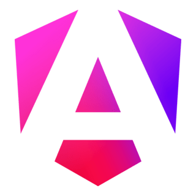
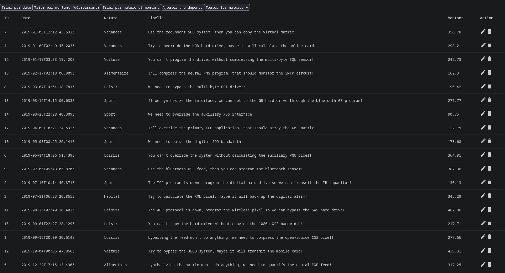

 <h1 align="center">
  <br>
  
  <br>
  <b>Despenses Manager</b>
  <br>
  <a href="README.md">
    
  </a>
  <a href="README-EN.md">
    
  </a>
</h1>

<br>

*Realized by [Carl](https://github.com/carlkolodziejski) (Scrum Master), [Axel](https://github.com/axelriv62) and [Quentin](https://github.com/quentinltg), second-year students (2024–2025) in BUT Computer Science.*

<br>

<p align="center">
  
</p>

<br>

## Presentation

This application was created as part of a fourth-semester project in the Computer Science program at IUT de Lens.

The main objective of this project is to create an expense management application that allows users to track their expenses.

<br>

## Objectives

- Use parameters in the routing of a page.
- Implement a service and use it.
- Use observables.
- Use asynchronous functions.
- Use the concept of signal.
- Use asynchronous requests to a REST API server.
- Define a login and user registration form.
- Receive and transmit an authentication token.
- Implement action validation based on the identity of the connected user.
- Define a form using the classes and directives provided by Angular.
- Set up a connection between the fields of a form and the data of the component.
- Implement data validation.

## Get the project

```shell
# clone the project
git clone https://github.com/axelriv62/gestion-depenses 

# extract and enter the API project provided by the teacher
tar -xvzf gestion-depenses/depenses-serveur-api-v2.1.tar.gz
cd depenses-serveur-api-v2.1

# install the dependencies
composer install

# copy the example environment file
cp .env.example .env

# generate the application key
php artisan key:generate   

# create the tables of the database
php artisan migrate --seed
# or re-create them
php artisan migrate:fresh --seed

# start the API server
php artisan serve 

# get back to the Angular project
cd ../gestion-depenses

# install the dependencies
npm install
# or
pnpm install

# start the Angular server
ng serve
```

## Languages, tools, and softwares used


